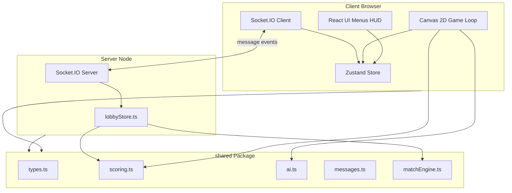

# Architecture

## Monorepo layout

```
penalty-kings/
├── package.json          # workspaces: shared, client, server
├── shared/               # @pk/shared — pure logic, no I/O
├── client/               # @pk/client  — browser app
└── server/               # @pk/server  — Socket.IO host
```

## High-level diagram



## Solo mode data flow

```
Input (drag/tap)
    → GameStateMachine (client/src/game/state.ts)
    → computeOutcome() (@pk/shared)
    → Animation (ball.ts, keeper.ts, striker.ts)
    → HUD update (Zustand)
```

- Game loop state lives in **plain JS objects**, not React state (avoids re-render overhead).
- React only renders menus, HUD overlays, and result screens.

## Online mode data flow

```
Client A: submit_shot ──┐
                        ├── Server: both intents received?
Client B: submit_dive ──┘         → computeOutcome()
                                  → applyTurnToMatch()
                                  → turn_result (both clients)
```

- Clients **never** decide GOAL/SAVED/MISSED locally for online play.
- Clients animate based on server `turn_result`.

## Client game engine modules

| Module | Responsibility |
|--------|----------------|
| `loop.ts` | `requestAnimationFrame`, delta-time, pause on tab hide |
| `state.ts` | Solo match state machine |
| `onlineState.ts` | Online match state machine |
| `input.ts` / `onlineInput.ts` | Pointer events → game actions |
| `geometry.ts` | Layout, zones, drag projection |
| `camera.ts` | Shooter vs keeper camera layouts |
| `renderer.ts` | Draw pitch, goal, characters, ball, UI |
| `ball.ts` | Parametric arc flight + trail |
| `keeper.ts` | Keeper dive animation state |
| `striker.ts` | Striker pose state machine |
| `characters.ts` | Procedural humanoid drawing |
| `trajectory.ts` | Preview arc computation + draw |
| `ai.ts` | Solo AI opponent wrapper |

## Server modules

| Module | Responsibility |
|--------|----------------|
| `index.ts` | HTTP + Socket.IO, message routing |
| `rooms/lobbyStore.ts` | Lobby CRUD, shot clock, turn resolution |

## Key design decisions

1. **Canvas 2D over WebGL/Phaser** — smallest bundle, full control
2. **Socket.IO over raw ws** — built-in rooms, reconnection, fallbacks
3. **Shared scoring** — one `computeOutcome()` for client prediction (solo) and server authority (online)
4. **Dual camera** — role-appropriate perspective (shooter behind player, keeper behind goal)
5. **In-memory lobbies** — no database for MVP; Redis optional later
