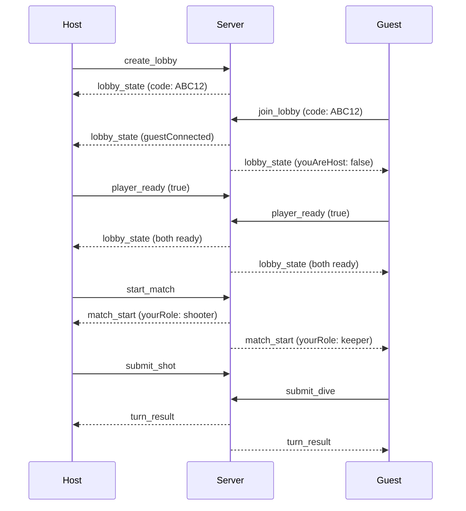

# Multiplayer

Real-time 2-player penalty shootout via Socket.IO lobbies.

## Quick start

1. Start server: `npm run dev:server`
2. Start client: `npm run dev:client`
3. Both players open the client URL
4. **Play Online** → Create Room / Join with code → Ready → Start

## Lobby flow



## Client → Server messages

| Type | Payload | Who sends |
|------|---------|-----------|
| `create_lobby` | — | Host |
| `join_lobby` | `{ code: string }` | Guest |
| `player_ready` | `{ ready: boolean }` | Both |
| `start_match` | — | Host only |
| `submit_shot` | `{ shot: Shot }` | Current shooter |
| `submit_dive` | `{ dive: Dive }` | Current keeper |
| `rematch` | — | Either (after match end) |

## Server → Client messages

| Type | Key fields |
|------|------------|
| `lobby_state` | `code`, `hostReady`, `guestReady`, `guestConnected`, `youAreHost` |
| `match_start` | `round`, `shooter`, `yourRole`, `score` |
| `turn_result` | `shot`, `dive`, `outcome`, `score`, `nextShooter`, `isSuddenDeath` |
| `match_end` | `score`, `winner: 'host' \| 'guest' \| 'draw'` |
| `opponent_disconnected` | `reconnectWindowMs` |
| `error` | `code`, `message` |

## Error codes

| Code | Meaning |
|------|---------|
| `lobby_full` | Room already has 2 players |
| `invalid_code` | Room code not found |
| `double_submit` | Shot or dive already sent this turn |
| `not_your_turn` | Wrong role for action |
| `not_ready` | Can't start — both players not ready |
| `match_in_progress` | Already in a lobby |

## Turn model

Each turn requires **both intents** before the server resolves:

```
Shooter → submit_shot { zone, power }
Keeper  → submit_dive { zone }
Server  → computeOutcome() → turn_result
```

**Shot clock:** 8 seconds. If time expires, server auto-fills missing intent (center zone).

## Role mapping

| Server side | Client sees |
|-------------|---------------|
| `shooter === yourSide` | `playerRole: 'shooter'` |
| `shooter !== yourSide` | `playerRole: 'keeper'` |

Score mapping via `scoreForClient(localSide, { host, guest })`.

## Online turn order

Round 1: Host shoots, Guest keeps  
Round 2: Guest shoots, Host keeps  
(alternates each turn)

## Client files

| File | Purpose |
|------|---------|
| `net/socketClient.ts` | Socket connect/send/receive |
| `ui/LobbyScreen.tsx` | Lobby UI |
| `ui/OnlineGameCanvas.tsx` | Online match canvas |
| `game/onlineState.ts` | Online state machine |
| `game/onlineInput.ts` | Online input → socket intents |

## Environment

```env
# Client (.env or build-time)
VITE_SERVER_URL=http://localhost:3001

# Server
PORT=3001
CLIENT_ORIGIN=http://localhost:5173
```

## Security model

- Clients cannot set outcome — only `Shot` and `Dive` intents
- Server validates zone ranges (0–8) and power (0–1)
- Server uses shared `computeOutcome()` as single source of truth
